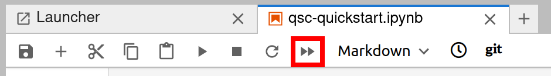
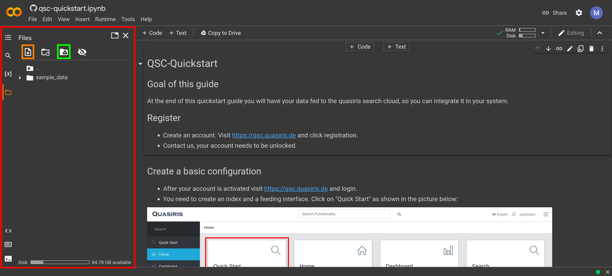
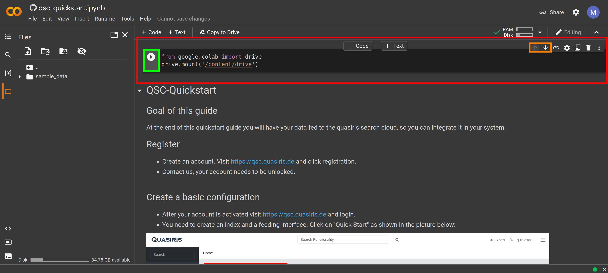
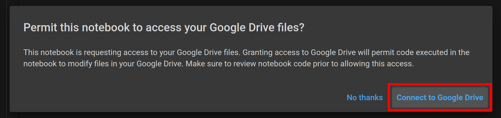
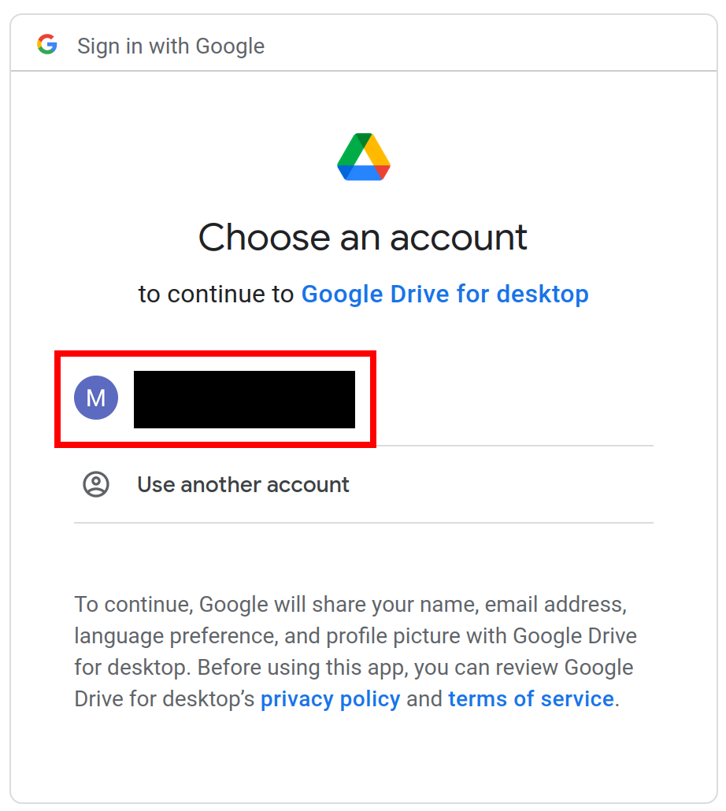
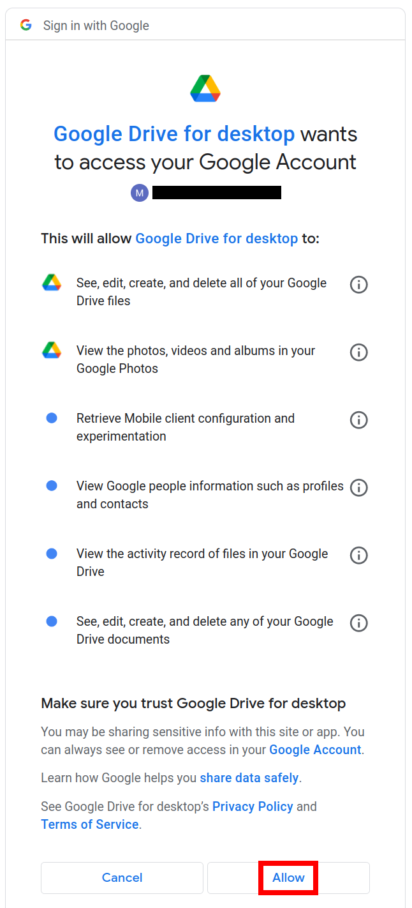
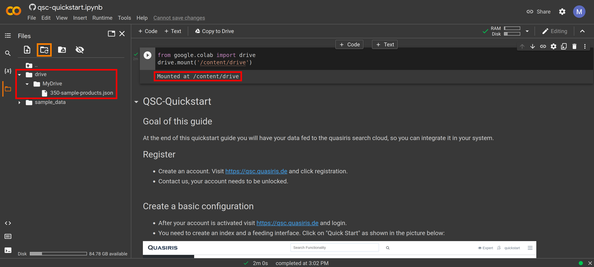
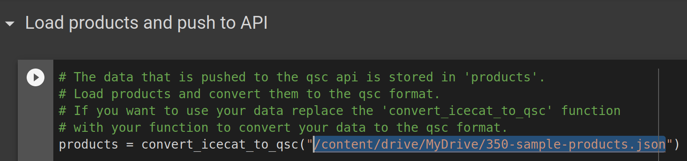

# Quickstart Guide Quasiris Search Cloud

//TODO link example data 
[Download]() the example data.

## Run locally
This example is written as a Jupyter Notebook. The easiest way to use it locally is to install Jupyter Lab. 
- Clone the repository.
- Paste example data under resources in the cloned repository.
- Make sure you have python and pip installed
- Install [Jupyter Lab](https://jupyterlab.readthedocs.io/en/stable/getting_started/installation.html)
- Open a terminal and execute "jupyter lab". Your browser should open with jupyter lab. If not open your browser and visit http://localhost:8888
- Use the file browser on the left and navigate to the cloned repository and open "qsc-quickstart.ipynb".
- Use the double arrow (see picture below) to run the notebook and follow the [instructions](qsc-quickstart.ipynb).

## Run at Google Colab
- Visit this project on [Google Colab](https://colab.research.google.com/github/quasiris/qsc-quickstart/blob/main/qsc-quickstart.ipynb)
- Sign in with your google account.
- You need to add your data. On the left side you have the file browser.

  - You can upload files using the upload button (Orange box).
  - You can mount your Google Drive and access all files that are stored there (Green box).
- In our case we mount Google Drive, which is more convinient when dealing with lager files.

### Connect to Google Drive
- First click the "Mount Drive" Button as shown in the picture above.
- This will insert a new cell as shown in the picture. Use the up arrow marked with the orange box to move the cell at the very top.

- Excecute the cell by clicking the run button marked with the green box and permit access to your Google Drive.

  - Select your account 
  
  - Allow access 
  
- If everything worked you should see a message under the cell that your Google Drive is mounted.
- After pressing the refresh button (orange box) you should be able to access your files.

### Access file in code
- Make sure the file is uploaded to your Google Drive.
- By hovering over a file in the file browser you get three dots right beside the filename. You can copy the path by
clicking on them and then select "Copy path"
- You can access this file by using that path. In our case we use the example data. We need to correct the path in the code,
as shown below, in order to use the example.

- After that you can click "Runtime"->"Run All" and follow the [instructions](qsc-quickstart.ipynb).