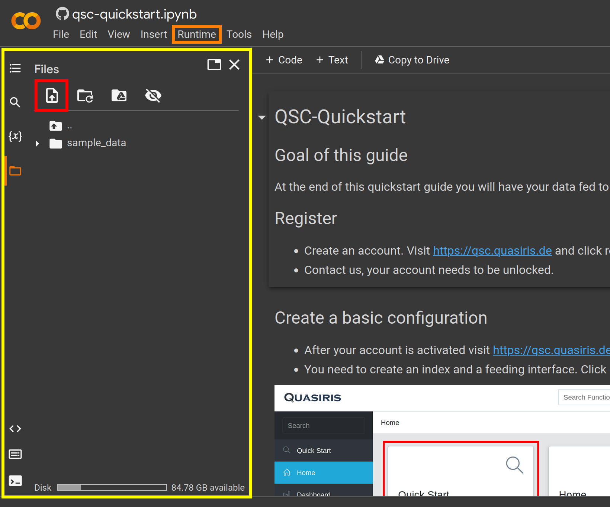

# Quickstart Guide Quasiris Search Cloud

//TODO link example data 
[Download]() the example data.

## Run locally
This example is written as a jupyter notebook. The easiest way to use it locally is to install jupyter lab. 
- Clone the repository.
- Paste example data under resources in the cloned repository.
- Make sure you have python and pip installed
- Install [Jupyter Lab](https://jupyterlab.readthedocs.io/en/stable/getting_started/installation.html)
- Open a terminal and execute "jupyter lab". Your browser should open with jupyter lab. If not open your browser and visit http://localhost:8888
- Use the file browser on the left and navigate to the cloned repository and open "qsc-quickstart.ipynb".
- Use the double arrow (see picture below) to run the notebook and follow the [instructions](qsc-quickstart.ipynb).

## Run at Google Colab
- Visit this project on [Google Colab](https://colab.research.google.com/github/quasiris/qsc-quickstart/blob/main/qsc-quickstart.ipynb)
- Sign in with your google account.
- On the left side you have the file browser.
- You need to create a folder called "resources" and upload the example data to that folder.
- To create a folder right click and select "New folder". To upload click upload button (see picture circled red) and select file.
- After that you can click "Runtime"->"Run All" and follow the [instructions](qsc-quickstart.ipynb).
